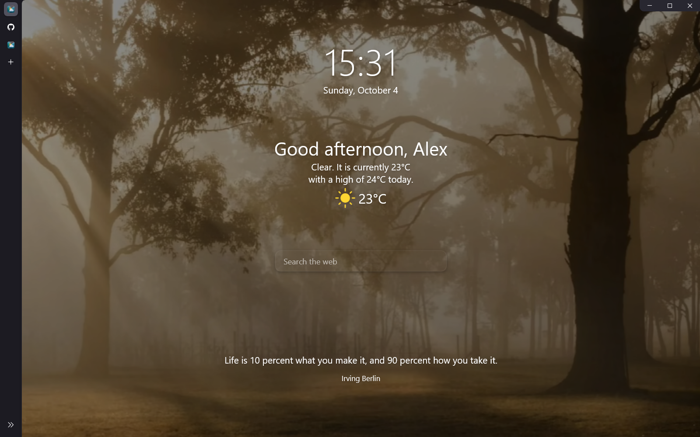
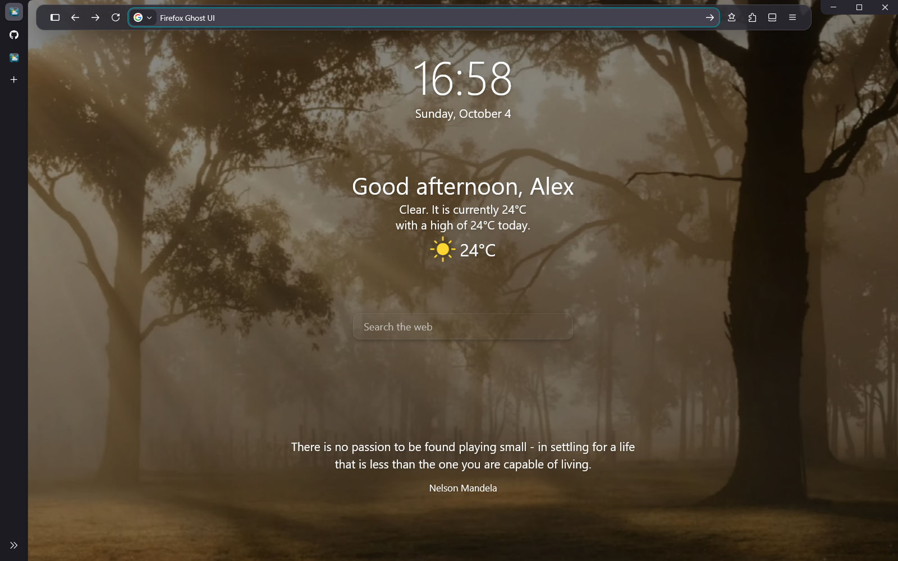
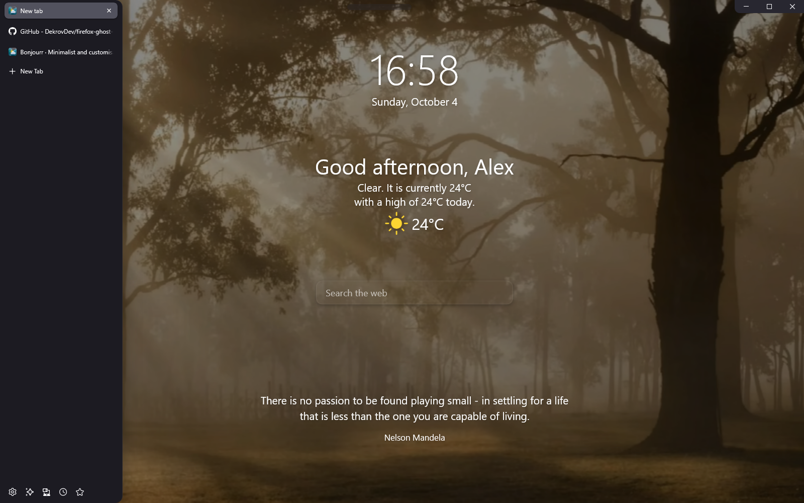

# Firefox Ghost UI

[English](README.md) · [Скачать для Windows](https://github.com/DekrovDev/firefox-ghost-ui/releases/latest)

Плавающая панель Firefox, вертикальные вкладки и плавные анимации Bonjourr.

**Расширения заметно влияют на внешний вид.** Ghost UI отвечает за плавающие панели, расположение вкладок и анимации. [Расширения ниже](#расширения-и-внешний-вид) добавляют фон и виджеты новой вкладки, подстраивают цвета браузера под сайт и создают дополнительную подсветку видео на YouTube. Для полного оформления настрой их вместе с темой.



**Чистая новая вкладка.** Верхняя строка скрыта, а центральный поиск Bonjourr остаётся доступным.

<details>
<summary>Посмотреть открытую строку и боковую панель</summary>

**Поиск по нажатию.** Ctrl+L сразу открывает штатную адресную строку Firefox.



**Вкладки под рукой.** Наведение раскрывает названия вкладок, не сдвигая страницу и не вызывая верхнюю строку.



</details>

На скринах — демонстрационный профиль на английском с дополнительным [Bonjourr](https://addons.mozilla.org/firefox/addon/bonjourr-startpage/). Фон, часы, погода и центральный поиск настраиваются в этом расширении отдельно. Установщик сохраняет твои настройки и язык. [Фоновое видео](https://pixabay.com/videos/id-83880/) взято из медиатеки Bonjourr и в установщик не входит.

## Как работает

Загрузки появляются отдельным «островком»: стрелка мягко опускается в лоток, а под ней идёт тонкая полоска прогресса. При завершении эта же полоска плавно сгибается в галочку, пока стрелка растворяется. Островок показывается ненадолго в начале, прячется, пока загрузка продолжается, и снова появляется после завершения; наведение и открытый список удерживают его. По нажатию открывается список файлов, а адресная строка остаётся скрытой. Предупреждения о загрузках остаются доступными. В режиме уменьшения движения галочка появляется без анимации.

Наведи мышь на верхний край в любом месте между вкладками и кнопками окна или на видимую ручку по центру. Панель начинает раскрываться через **0,12 секунды**, а все кнопки появляются примерно за полсекунды. **Ctrl+L** открывает строку сразу. После ухода мыши вся панель остаётся видимой ещё **2 секунды**, затем плавно исчезает. Возвращение мыши отменяет закрытие. После Enter ожидания нет: строка плавно бледнеет и сворачивается примерно за 0,3 секунды; при вводе и открытых меню панель остаётся доступной.

Кнопка меню закладок открывает сохранённые сайты. Те, что раньше были под адресной строкой, находятся в пункте **Панель закладок** этого меню.

Кнопки свернуть, развернуть и закрыть скрыты и плавно появляются при наведении в правый верхний угол. В обычном окне зона вызова высотой 16 пикселей: она захватывает участок ниже рамки изменения размера Windows. В развёрнутом окне достаточно верхних 8 пикселей. Пока курсор на кнопках, они остаются доступны; после ухода прячутся. Ниже зоны вызова можно нажимать элементы страницы. Боковая панель раскрывается при наведении, не сдвигая страницу. Пока открыт боковой инструмент, вкладки остаются компактной полоской значков: настройки, история, закладки и расширения полностью видны, а их кнопки не двигаются при наведении. После закрытия инструмента обычное раскрытие вкладок возвращается. Подсказки вкладок не вызывают верхнюю строку. Скрытая панель пропускает клики к странице вне видимой ручки и полоски вызова высотой 3 пикселя вдоль верхнего края. В полноэкранном режиме панели скрыты.

## Автоматическая установка

1. Установи обычный Firefox для Windows и открой его хотя бы один раз.
2. [Скачай ZIP из последнего релиза](https://github.com/DekrovDev/firefox-ghost-ui/releases/latest) и **распакуй весь архив**.
3. Дважды нажми **Install.cmd**. Если профилей несколько, выбери нужный.
4. Когда установщик попросит, закрой Firefox обычным способом и нажми Enter.
5. Запусти Firefox.

Права администратора, Git и Python не нужны. Используется встроенный Windows PowerShell 5.1. Скрипт работает локально, создаёт резервные копии и не меняет общую политику запуска PowerShell.

Оформление проверено на **Firefox 156.0.1 под Windows**. Другие версии Firefox, macOS и Linux пока не проверены. Проверки установщика выполняются в PowerShell 5.1 и PowerShell 7.

Анимация загрузок из **1.0.9** дополнительно проверена на **Firefox 157.0.1 под Windows**: скачивание файлов, короткие уведомления начала и завершения, нажатия на список файлов, предупреждения, уменьшение движения и выравнивание при масштабе 100%, 125% и 150%. Это проверка островка загрузок; полная проверка интерфейса ранее выполнялась на 156.0.1.

## Расширения и внешний вид

Для оформления, близкого к скриншотам, используй **Bonjourr** для новой вкладки и **Adaptive Tab Bar Colour** для цветов браузера, которые сочетаются с текущим сайтом. **Ambient Light для YouTube** добавляет отдельный эффект при просмотре видео. Ghost UI работает и самостоятельно; расширения отвечают за такие части внешнего вида:

- [Bonjourr](https://addons.mozilla.org/firefox/addon/bonjourr-startpage/) — фон или фоновое видео, часы, погода, приветствие, цитаты, быстрые ссылки и центральный поиск на новой вкладке. Всё это настраивается в Bonjourr. После установки расширения закрой Firefox и ещё раз запусти **Install.cmd**: анимации Ghost UI подключатся автоматически. Центральный поиск включается в настройках самого Bonjourr.
- [Adaptive Tab Bar Colour](https://addons.mozilla.org/firefox/addon/adaptive-tab-bar-colour/) — подстраивает цвета темы Firefox под текущий сайт. Ghost UI использует эти цвета для своих панелей, поэтому верхняя строка и боковая панель лучше сочетаются со страницей. Рекомендуется для эффекта меняющихся цветов.
- [Ambient Light для YouTube](https://addons.mozilla.org/firefox/addon/ambient-light-for-youtube/) — добавляет подсветку вокруг видео на YouTube, используя цвета текущего изображения. Дополняет оформление страницы с видео; для остальных панелей браузера устанавливается по желанию.

Установку расширений нужно подтвердить в Firefox. Они не входят в архив. Собственные настройки Bonjourr сохраняются: установщик не подставляет чужие фон, город, имя или ссылки.

Чтобы Bonjourr открывался при запуске Firefox и в новых окнах, зайди в **Настройки → Начало** и выбери **Bonjourr** в пунктах **Домашняя страница и новые окна** и **Новые вкладки**. Это разные настройки: если назначить Bonjourr только для новых вкладок, при запуске может открываться стандартная страница Firefox. При отключённых виджетах она выглядит пустой. Установщик сохраняет твой выбор домашней страницы и восстановления сессии.

## Обновление и удаление

Для обновления распакуй новый релиз, закрой Firefox и снова запусти **Install.cmd**. Первая резервная копия сохраняется, настройки не дублируются.

Для отката закрой Firefox и запусти **Uninstall.cmd**. Он восстановит прежние CSS, `user.js` и значения семи настроек интерфейса. Остальные текущие настройки сохранятся. Резервные копии остаются в папке выбранного профиля `chrome/ghost-ui-backups/`.

Если управляемые файлы вручную изменены, обновление или удаление остановится, чтобы сохранить эти правки. Резервные копии доступны для ручного восстановления.

## Что меняется

Файлы оформления копируются в `chrome/ghost-ui/`. Существующие пользовательские CSS сохраняются и подключаются из той же папки `chrome/`. Ранее установленная вручную версия Ghost UI сохраняется в резервной копии и заменяется, чтобы не загружать оформление дважды.

В `user.js` добавляется отдельный блок:

| Настройка | Значение |
| --- | --- |
| `toolkit.legacyUserProfileCustomizations.stylesheets` | `true` |
| `sidebar.revamp` | `true` |
| `sidebar.verticalTabs` | `true` |
| `sidebar.visibility` | `expand-on-hover` |
| `browser.tabs.inTitlebar` | `1` |
| `browser.download.alwaysOpenPanel` | `false` |
| `browser.download.panel.shown` | `true` |

Если Bonjourr установлен, его CSS подключается через `userContent.css` только для адреса этого расширения в выбранном профиле. Настройки самого Bonjourr не переписываются.

Установщик добавляет кнопку меню закладок, если её ещё нет, сохраняя расположение остальных кнопок. Удаление темы убирает только эту добавленную кнопку и сохраняет последующие изменения панели. Уже существующая кнопка или раскладка, закреплённая через `user.js`, остаётся как настроена; кнопку **Меню закладок** можно добавить вручную в настройке панели инструментов.

Базы закладок и истории не редактируются. Процессы Firefox принудительно не завершаются. Другие темы интерфейса могут конфликтовать с оформлением. Для нестандартной папки профиля можно указать путь явно:

```powershell
./Install.ps1 -ProfilePath 'D:\Firefox Profiles\Personal' -NoPrompt
./Uninstall.ps1 -ProfilePath 'D:\Firefox Profiles\Personal' -NoPrompt
```

Для настройки задержки измени `--ghost-open-wait` в `theme/userChrome.css` перед установкой.

«Островок» использует обычную кнопку **Загрузки** в панели навигации. Если ты перенёс её в дополнительное меню, верни через **Настройку панели инструментов**. Установщик отключает автоматическое открытие списка файлов, включая подсказку при первой загрузке; при удалении обе прежние настройки панели загрузок восстанавливаются.

## Проверки и сборка

```powershell
./tests/Installer.Tests.ps1
./scripts/Build-Release.ps1 -Version 1.0.9
```

Проверки используют временные профили и не трогают настоящий браузер. В релиз попадают только файлы из явного списка: личные профили, резервные копии, скриншоты и история разработки исключены.

Лицензия MIT. Это самостоятельное оформление; Firefox и перечисленные расширения — отдельные проекты.
